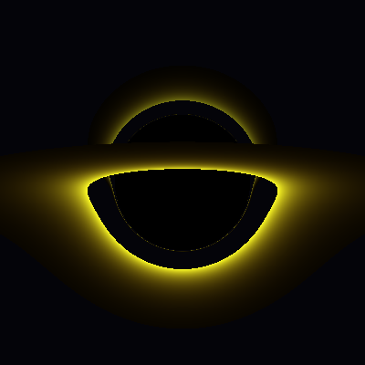

# OPPENGROK Black Hole Simulation Lab



*A gravitationally lensed thin accretion disk at 80 deg inclination, rendered
by this engine from the validated Schwarzschild null-geodesic equation. The
disk's far side is bent up and over the shadow by spacetime curvature — the
canonical lensed-black-hole image. Geometry is `numerical_approximation`;
colour is a `visualization_metaphor` (no Doppler/redshift yet). See
[docs/images/](docs/images/README.md).*

Research-first C++20 black hole simulation lab, building toward a **visual,
GPU-accelerated black hole simulation you can run on your own machine**.
The development target is an RTX-class consumer GPU (reference hardware:
NVIDIA RTX 5070 Ti 12 GB, Intel Core Ultra 9 275HX, 80 GB DDR5); the repo
is for anyone with that class of GPU power who wants a scientifically
honest simulation rather than a screensaver.

The path there is deliberate: analytic observables first (done), then
geodesic integration, then a ray-marched photon renderer that consumes the
validated physics kernel. Every value the simulation produces is labeled
with its scientific truth tier — beauty never outranks correctness.

This is the real local repository. Source code, research notes, audits,
tests, logs, and architecture decisions belong here and get committed
through Git. ZIP files are intake artifacts only, never the source of truth.

> **License:** AGPL-3.0 · **CI:** GitHub Actions on `windows-latest`
> (MSVC, green) · **Language:** C++20 + Python 3.11 · **Build:** CMake ≥ 3.20

## Table of Contents

- [Current Status](#current-status)
- [Quickstart](#quickstart)
- [Repository Layout](#repository-layout)
- [Build and Test](#build-and-test)
- [Scientific Truth Labels](#scientific-truth-labels)
- [Development Workflow](#development-workflow)
- [Documentation Map](#documentation-map)
- [Project Rules](#project-rules)
- [Next Milestones](#next-milestones)

## Quickstart

```powershell
# Clone, build, test, run — Windows PowerShell.
git clone https://github.com/0thernes/Stress-Test-Agents-Maxxxing.git
cd Stress-Test-Agents-Maxxxing

cmake -S . -B build -DCMAKE_BUILD_TYPE=Release
cmake --build build --config Release
ctest --test-dir build -C Release --output-on-failure

# Analytic observables for a 10 solar-mass, spin-0.9 black hole as CSV:
.\build\Release\blackhole_ds.exe --mass 10 --spin 0.9 --format csv

# Bend a light ray (impact parameter b/M = 5.5 -> ~146 degree deflection):
.\build\Release\blackhole_ds.exe --deflection 5.5

# Render the black-hole shadow as ASCII art:
.\build\Release\blackhole_ds.exe --shadow

# Render a real raster image (shadow + photon ring) to a PPM file:
.\build\Release\blackhole_ds.exe --image shadow.ppm
# View it in any image viewer, or convert: magick shadow.ppm shadow.png
```

New here? Read [docs/INDEX.md](docs/INDEX.md) (the documentation map) and
[docs/GLOSSARY.md](docs/GLOSSARY.md).

## Current Status

A validated analytic core that now bends light and draws its first images —
not yet a GRMHD or numerical-relativity solver, and not yet a lensed
accretion-disk render, but past "calculator" and onto the visual ladder.

Implemented now:

- C++20 modular kernel: `core/` (constants, truth labels), `metrics/`
  (exact Schwarzschild and Kerr observables), `integrators/` (tested RK4 +
  adaptive Dormand-Prince), `geodesics/` (Schwarzschild photon orbits —
  light bending, validated against the Eddington 4M/b deflection),
  `viz/` (ASCII shadow + PPM raster shadow/photon-ring render),
  `data/` (full-precision CSV export).
- CLI executable with `--mass`, `--spin`, `--format text|csv`, `--steps`,
  `--deflection <b/M>` (light bending), `--shadow` (ASCII shadow), and
  `--image <file.ppm>` (raster shadow + photon ring, with the measured
  shadow radius validated against the analytic sqrt(27) M).
- Strong physical-units header (`include/blackhole_ds/units.hpp`) with
  compile-time dimensional safety, enforced by tests.
- Brain/Soul reasoning-lens corpus: 20 XML profiles (physicists,
  mathematicians, astronomers) with XSD schema and validation.
- Research source-card corpus: 20 foundational sources (1828-2025) with
  JSON Schema, truth-tier labels, and a JSONL RAG index.
- SQLite star schema (`data/schema.sql`) and Python data-science harness.
- Deterministic corpus generators with a CI drift gate.
- Vision, mission, scientific integrity charter, ADRs, ERD and system
  diagrams, daily workflow automation, CI on GitHub Actions.

Not implemented yet (in build order):

- Full equatorial geodesic with conserved-quantity tracking (the current
  photon module integrates the orbit shape; finishing M1).
- Lensed background + accretion-disk rendering (the ASCII shadow is a
  silhouette only — no lensing of a star field, no disk, no colour yet).
- Ray-marched photon renderer on the GPU (the headline goal; the CPU
  shadow is the seed of it).
- GRMHD or numerical-relativity solver.
- Truth-tier column in the SQLite schema.
- Production Power BI/Excel templates.
- Tsotchke ecosystem integrations (planned, ADR-gated; see
  `docs/integrations/`).

## Repository Layout

```text
.
|-- CMakeLists.txt                  C++20 build (CMake >= 3.20)
|-- README.md
|-- AUDIT-250-POINT-GOLD-STANDARD.md
|-- CODEOWNERS / CONTRIBUTING.md / SECURITY.md / LICENSE (AGPL-3.0)
|-- assets/diagrams/                Source diagrams (Mermaid)
|-- data/schema.sql                 Canonical SQLite star schema
|-- docs/
|   |-- architecture/               ARCHITECTURE, HIERARCHY, ERD, diagrams
|   |-- audits/                     Audit reports (see latest full review)
|   |-- integrations/               Tsotchke / Eshkol integration plans
|   |-- log/                        DAILY_LOG + DECISIONS (ADRs)
|   |-- operations/ planning/ process/ reports/ testing/
|   |-- research/                   Research program + source_cards/
|   |-- source/                     Philosophy and audit input material
|   `-- vision/                     VISION, MISSION, integrity charter
|-- external/                       Third-party adapters (ADR-gated, opt-in)
|-- include/blackhole_ds/
|   |-- units.hpp                   Strong-typed physical quantities
|   |-- core/ metrics/ data/        Kernel headers
|-- knowledge/
|   |-- brains/                     Reasoning-lens XML profiles + seeds
|   `-- papers/                     Source seeds + JSONL RAG index
|-- schemas/                        brain_soul.xsd, source_card.json
|-- scripts/
|   |-- Validate-ResearchOS.py      Umbrella validation gate
|   |-- brains/ research/           Corpus generators + validators
|   |-- dev/                        build/test/audit/Daily-Commit helpers
|   `-- local/                      Package intake (legacy)
|-- src/
|   |-- cli/main.cpp                CLI entry point
|   `-- core/ metrics/ integrators/ data/   Future module homes
|-- tests/smoke_tests.cpp           Analytic + dimensional-safety tests
`-- tools/blackhole_ds_harness.py   Python reference harness
```

## Build And Test

Windows PowerShell:

```powershell
cmake -S . -B build -DCMAKE_BUILD_TYPE=Release
cmake --build build --config Release
ctest --test-dir build -C Release --output-on-failure
python scripts/Validate-ResearchOS.py
```

Linux/macOS shell:

```bash
cmake -S . -B build -DCMAKE_BUILD_TYPE=Release
cmake --build build
ctest --test-dir build --output-on-failure
python3 scripts/Validate-ResearchOS.py
```

Run the seed executable:

```powershell
.\build\Release\blackhole_ds.exe
```

or, depending on generator:

```powershell
.\build\blackhole_ds.exe
```

## Scientific Truth Labels

All features must declare their model status:

- `analytic_classical`: exact or standard analytic GR result.
- `numerical_approximation`: numerical method with documented error bounds.
- `observational_constraint`: anchored to published/open observational data.
- `visualization_metaphor`: explanatory visual, not a physics claim.
- `pedagogical_simplification`: teaching simplification with stated limits.
- `speculative_extension`: frontier idea, clearly separated from validated code.

The project must never mix these labels casually. A plot can be beautiful and
still be wrong; the data and validation decide.

## Development Workflow

The everyday loop is wrapped in a single script. See
[`docs/process/DAILY_WORKFLOW.md`](docs/process/DAILY_WORKFLOW.md) for the
full reference.

```powershell
.\scripts\dev\Daily-Commit.ps1 -Message "Short imperative subject" -Push
```

That script runs the validation gate, then build, then tests, and only
commits and pushes when everything passes. Skip steps you do not need
with `-SkipBuild` or `-SkipTests`.

Individual helpers:

```powershell
.\scripts\dev\build.ps1                # cmake configure + build
.\scripts\dev\test.ps1                 # ctest with output-on-failure
.\scripts\dev\audit.ps1                # validation + corpus rebuild
.\scripts\dev\clean.ps1                # wipe build/exports/_incoming
.\scripts\dev\Install-PreCommitHook.ps1   # gate every git commit
```

Manual loop:

```powershell
git status
python scripts/Validate-ResearchOS.py
cmake -S . -B build -DCMAKE_BUILD_TYPE=Release
cmake --build build --config Release
ctest --test-dir build -C Release --output-on-failure
git add -A
git commit -m "Describe the research or engineering increment"
git push origin main
```

Incoming ZIP/package workflow:

```powershell
powershell.exe -ExecutionPolicy Bypass -File .\scripts\local\Sync-OppengrokLocalRepo.ps1 `
  -PackagePath "$env:USERPROFILE\Downloads\oppengrok-blackhole-sim-v5-research-os.zip" `
  -RemoteUrl "https://github.com/0thernes/Stress-Test-Agents-Maxxxing.git" `
  -Push
```

That script archives and extracts packages under `_incoming/`, creates a backup
branch, validates, commits, rebases, and pushes only when `-Push` is supplied.

## Documentation Map

Full index: [docs/INDEX.md](docs/INDEX.md). The essentials:

| Area | Document |
|---|---|
| Vision / why | [VISION](docs/vision/VISION.md), [MISSION](docs/vision/MISSION.md) |
| Scientific rules | [Integrity Charter](docs/vision/SCIENTIFIC_INTEGRITY_CHARTER.md) |
| Architecture | [ARCHITECTURE](docs/architecture/ARCHITECTURE.md), [HIERARCHY](docs/architecture/HIERARCHY.md) |
| Data model | [ERM + data dictionary](docs/architecture/ERM.md), [ERD](docs/architecture/ERD.md) |
| Algorithms | [COMPLEXITY](docs/engineering/COMPLEXITY.md) |
| Plan | [ROADMAP](docs/planning/ROADMAP.md), [KANBAN](docs/process/KANBAN.md) |
| Resources | [Engineering Resource Plan](docs/operations/ENGINEERING_RESOURCE_PLAN.md) |
| Decisions | [ADRs](docs/log/DECISIONS.md), [Daily Log](docs/log/DAILY_LOG.md) |
| Quality | [Full Audit](docs/audits/AUDIT-2026-06-12-FULL-REPO-REVIEW.md), [500-Point Inspection](docs/audits/INSPECTION-500-POINT.md) |
| Terms | [GLOSSARY](docs/GLOSSARY.md) |

## Project Rules

- No ZIP-as-final workflow.
- No untracked project work after a meaningful change.
- No generated build/data exports committed unless explicitly curated.
- No secrets, credentials, tokens, private keys, or local daemon state.
- Research claims need a source, a truth label, and a validation path.
- Tests must grow with risk: unit tests first, then CLI/data E2E, then A/B and
  numerical benchmarks.
- Architecture decisions go in `docs/architecture/`.
- Project progress goes in `docs/reports/PROJECT_LOG.md`.

## Next Milestones

The visual simulation is the destination; these are the steps in order.

1. First geodesic integrator (null geodesics in Schwarzschild, RK45 with
   error control), validated against the analytic photon sphere.
2. Truth-tier column in `data/schema.sql` plus matching exporter and
   harness updates, so exact values and approximations can never share a
   table unlabeled.
3. E2E test: run executable, emit data, validate schema ingest round-trip.
4. A/B harness for integrator candidate comparison (error, runtime,
   stability).
5. Kerr geodesics + first lensed-image computation on CPU.
6. GPU port of the ray marcher (CUDA, RTX 5070 Ti class) - the first
   visual prototype: gravitationally lensed accretion-disk render with
   honest tier labeling (visualization_metaphor for color mapping,
   analytic/numerical tiers for the geometry underneath).
7. First tsotchke integration (libirrep) per ADR-0005.

This repo is now the place where that work happens.
