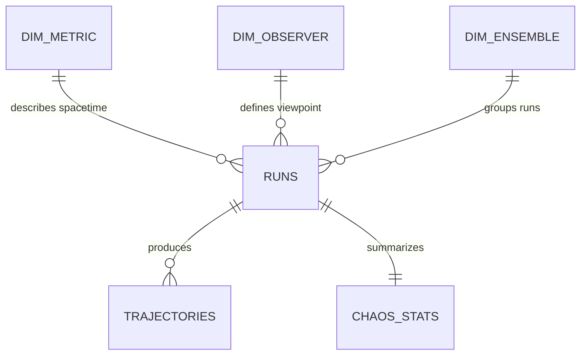

# Entity-Relationship Diagram

The canonical data model for BlackHoleDS is defined by `data/schema.sql`.
This document is the human-readable mirror of that schema.

## Rendering

The diagram source lives at `docs/architecture/diagrams/erd.mmd` in
Mermaid syntax. Render it inline in:

- GitHub (Mermaid is supported natively in Markdown).
- VS Code with the `bierner.markdown-mermaid` extension.
- The Mermaid CLI (`mmdc -i erd.mmd -o erd.svg`).

See `docs/architecture/diagrams/erd.mmd` for the full diagram with all
attributes. Update both files together. If they drift, the SQL schema is
the source of truth.

## Star Schema Overview

The model is a classical star schema. Fact tables in the center:

- **RUNS** — one row per (metric, parameter set, seed). Holds derived
  observables: photon sphere, ISCO, shadow diameter, Hawking temperature,
  Lyapunov, causal graph features.
- **TRAJECTORIES** — high-resolution time series for individual particles
  (photons, timelike geodesics, accretion fluid, Hawking quanta).
- **CHAOS_STATS** — per-run aggregates for chaos and graph features
  (Lyapunov spectrum, correlation dimension, persistent homology, etc.).

Dimensions around the facts:

- **DIM_METRIC** — Schwarzschild, Kerr, Kerr-Newman, Kerr-de Sitter.
- **DIM_OBSERVER** — inclination, distance, phi offset.
- **DIM_ENSEMBLE** — grouped runs with a base seed and theory version.

## Reproducibility Columns

Every row in `RUNS` carries `rng_seed`, `git_commit`, `integrator`,
`integrator_tol`, `created_at`. These are the floor for reproducibility,
not the ceiling. Future iterations may add a `parameters_hash` and a
`build_id`.

## Power BI Star View

`v_powerbi_runs` is a flattened view joining `RUNS`, `DIM_METRIC`, and
`DIM_OBSERVER`. Import this view into Power BI to start the semantic model.

## Schema Changes

Schema changes require an Architecture Decision Record in
`docs/log/DECISIONS.md`, must be applied to:

1. `data/schema.sql`
2. `docs/architecture/diagrams/erd.mmd`
3. `docs/architecture/ERD.md` (this document)
4. The C++ exporter in `src/data/` (when it exists)
5. `tools/blackhole_ds_harness.py`

…in the same commit. Drift between the schema and any of the consumers is
a production bug.
