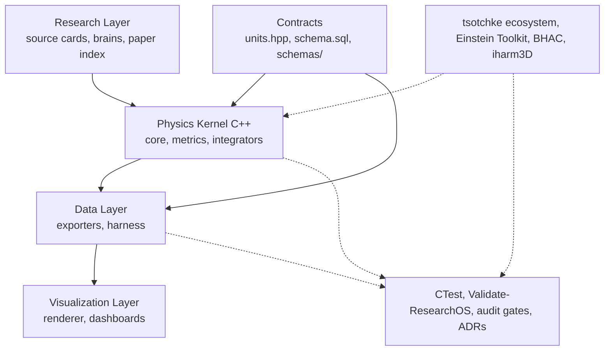
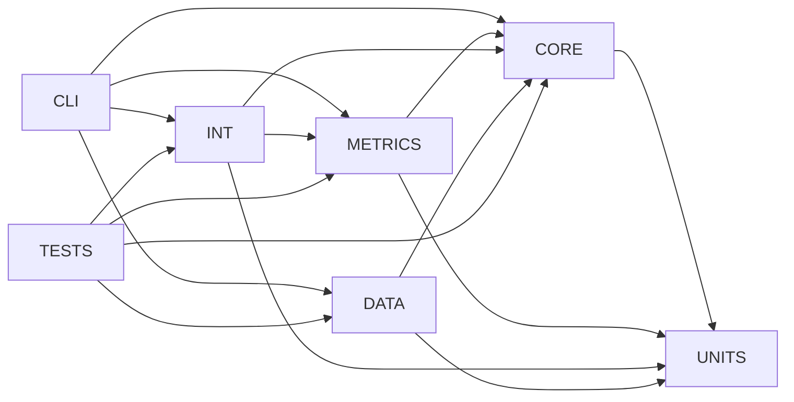

# System Diagram

The end-to-end pipeline of the project, from research input to validated
output.

## Rendering

Diagram source: `docs/architecture/diagrams/system_pipeline.mmd`.

See `docs/architecture/diagrams/system_pipeline.mmd` for the full diagram
with subgraphs and labeled flows.

## Layer Responsibilities

- **Research Layer** — `docs/research/source_cards/`, `knowledge/brains/`,
  and `knowledge/papers/`. Decides what is real, what is approximate, and
  what is speculative. Updates the truth-tier labels in the kernel.
- **Contracts** — `units.hpp` for type safety, `data/schema.sql` for the
  data model, `schemas/` for XML and JSON schemas. Contracts change rarely
  and only via ADRs.
- **Physics Kernel** — currently header-only under
  `include/blackhole_ds/{core,metrics,integrators}/`; compiled units will
  appear under `src/{core,metrics,integrators}/` as modules grow. No I/O,
  no schema dependencies. Pure computation on typed quantities.
- **Data Layer** — `include/blackhole_ds/data/csv_writer.hpp` (and future
  `src/data/`) plus `tools/blackhole_ds_harness.py`. Translates kernel
  output into the schema; exports CSV today, JSON/SQLite planned.
- **Visualization Layer** — future `src/viz/` and Power BI/Excel
  consumers. Reads exported data; never owns physics.
- **External Ecosystem** — `tsotchke` repositories and established
  simulators. Integrated under `external/`, pinned by commit SHA, wrapped
  by adapter modules.
- **Audit Layer** — `tests/`, `scripts/Validate-ResearchOS.py`, the audit
  document at the root, and the ADRs.

## Module Dependency

For the C++ module dependency view (the target shape after Iteration 7),
see `docs/architecture/diagrams/module_dependency.mmd`:

