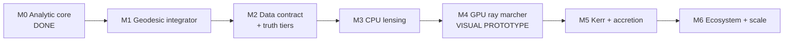

# Roadmap

The destination is a **visual, GPU-accelerated black hole simulation** that
runs on RTX-class consumer hardware and is scientifically honest about
every pixel. This roadmap is the ordered path from the current validated
analytic core to that destination.

Each milestone has an explicit **exit criterion**. A milestone is not
"done" until its exit criterion is met, tested, and merged.

---

## M0 — Analytic core and research infrastructure (DONE)

- Strong-typed units, exact Schwarzschild/Kerr observables, CLI, CSV export.
- RK4 + adaptive Dormand-Prince integrators with convergence tests.
- Brain corpus, source-card corpus, vision/charter, ADRs, CI green.

**Exit criterion (met):** every analytic value matches the literature to
the documented tolerance; CI is green on `windows-latest`; all gates gate.

## M1 — Geodesic integrator (IN PROGRESS)

Build the Schwarzschild null-geodesic right-hand side and integrate it.

Done (2026-06-13):
- Equatorial photon orbit equation `d^2u/dphi^2 + u = 3u^2` integrated by
  RK4 (`include/blackhole_ds/geodesics/schwarzschild_photon.hpp`).
- Critical impact parameter `b_crit = sqrt(27) M`, escape/capture/critical
  classification, photon turning point, total light-deflection angle.
- Validated against the weak-field Eddington deflection `4M/b` and the
  photon-sphere capture boundary (`tests/geodesic_tests.cpp`).
- `--deflection <b/M>` CLI flag for runnable, labeled output.

Remaining for M1:
- A full equatorial geodesic in (t, r, phi) with conserved E, L tracked by
  the Kahan accumulator (the current form integrates the orbit shape u(phi);
  the next step also tracks affine/coordinate evolution for a ray tracer).
- Tighten the deflection regression to a published high-precision table.

**Exit criterion:** a ray bundle reproduces the analytic deflection curve
and the photon-sphere capture boundary within tight tolerance, with a
regression test. (Partially met: the deflection and capture boundary are
validated; the conserved-quantity-tracked ray remains.)

## M2 — Data contract and truth tiers

- Add the `model_status` column to `runs`; update the C++ exporter and the
  Python harness together (schema-change ADR).
- JSON exporter alongside CSV.
- First C++ → SQLite path.
- E2E test: run → emit → ingest → validate.

**Exit criterion:** a reproducible run produces queryable, truth-tier
labeled data that round-trips through the schema, verified by an E2E test.

## M3 — CPU gravitational lensing (SUBSTANTIALLY DONE, 2026-06-13)

- One ray per image pixel; integrate backward from the camera. DONE
  (`include/blackhole_ds/viz/disk_image.hpp`).
- Map escaped rays to a background; captured rays to the shadow; rays that
  cross the disk plane to accretion-disk emission. DONE.
- Schwarzschild (no spin), equatorial thin disk, general inclination. DONE.
- Reference renders checked into `docs/images/` (lensed disk at 80 deg and
  20 deg, bare shadow + photon ring); shown at the top of the README. DONE.
- Shadow radius validated to within one pixel of sqrt(27) M
  (`tests/render_tests.cpp`); disk geometry validated by exact symmetry
  invariants (`tests/disk_tests.cpp`). DONE.

Remaining polish (carried into M5): brightness is currently a radius-based
visualization_metaphor; physically-correct surface brightness with Doppler
beaming and gravitational redshift is M5.

**Exit criterion:** a CPU render of the Schwarzschild shadow + lensed disk
whose shadow diameter matches 2√27 M to within one pixel, with the image
checked into `docs/` as a reference. **MET** (shadow radius within 1px;
reference images committed).

## M4 — GPU ray marcher (the visual prototype)

- Port the per-pixel ray integration to CUDA (one thread per pixel).
- Target the RTX 5070 Ti (~8900 CUDA cores, 12 GB GDDR7).
- Interactive or near-interactive frame times for a moderate resolution.
- Honest tier labeling baked into the render metadata (geometry tiers
  analytic/numerical; color mapping `visualization_metaphor`).

**Exit criterion:** the GPU render matches the M3 CPU reference image to
within numerical tolerance, runs at least an order of magnitude faster, and
ships with a documented build path for RTX-class hardware.

## M5 — Kerr, spin, and accretion physics (IN PROGRESS)

- Doppler beaming and gravitational redshift on the disk. DONE — exact
  Schwarzschild thin-disk redshift factor `g`, flux ∝ g⁴
  (`viz/disk_image.hpp`); the EHT-style bright/dim crescent.
- Frame dragging and the asymmetric shadow. DONE for the shadow — the
  closed-form Bardeen 1973 spherical-photon-orbit boundary
  (`geodesics/kerr_shadow.hpp`, `--kerr-shadow`), an asymmetric D-shape that
  reduces exactly to the sqrt(27) M Schwarzschild circle as a → 0 (tested).
  Reference render `docs/images/kerr_shadow_a099_i80.png`.
- Kerr null geodesics (Carter constant). DONE — `geodesics/kerr_geodesic.hpp`,
  the Carter-separated equations of motion in Mino time, validated by
  conserved-quantity drift + a cross-check against the closed-form photon orbit.
- Frame-dragged Kerr lensed accretion-disk image. DONE —
  `viz/kerr_disk_image.hpp` + `--kerr-disk`: per-pixel backward ray tracing
  through the Kerr geodesic, equatorial-crossing detection for the lensed disk,
  horizon capture for the shadow, and the Kerr circular-orbit redshift factor
  for Doppler beaming. Anchored by an a → 0 regression against the Schwarzschild
  disk tracer. Reference render `docs/images/kerr_disk_a09_i78.png`.
- REMAINING for full M5: a quantitative spin-vs-shadow-asymmetry curve compared
  against published EHT-style values (the comparison is currently qualitative);
  optional GRMHD-style emissivity instead of the illustrative ramp.

**Exit criterion:** a Kerr render shows the characteristic asymmetric
photon ring; shadow asymmetry vs spin matches published EHT-style curves
qualitatively, with the comparison documented. (Shadow boundary + asymmetry
metric done and tested; quantitative spin-vs-asymmetry curve comparison and
the Kerr disk ray trace remain.)

## M6 — Ecosystem integration and scale

- First `tsotchke/libirrep` integration (symmetry math) per ADR-0005.
- Eshkol DSL layer for metric definitions (ADR + staged rollout).
- A/B integrator harness, PI step controller, performance regression suite.
- Optional: GRMHD / numerical-relativity comparison against the Einstein
  Toolkit or BHAC as a benchmark.

**Exit criterion:** at least one external integration is wired,
SHA-pinned, and opt-in per the policy; performance regressions are caught
by CI.

---

## Cross-cutting tracks (run continuously)

- **Audit remediation.** Burn down the 47 open findings from the
  2026-06-12 report; never let the open-critical count rise above zero.
- **Research corpus.** Grow the source cards and brain profiles as physics
  is implemented; every formula gets a source card before it ships.
- **CI/CD.** Keep the matrix green; add checks as the surface grows.

## Sequencing rule

Physics never outruns evidence, and code never outruns tests. A milestone
that would add a visual or a number without a validation path is reordered
until the validation exists. Beauty is the reward for correctness, not a
substitute for it.
